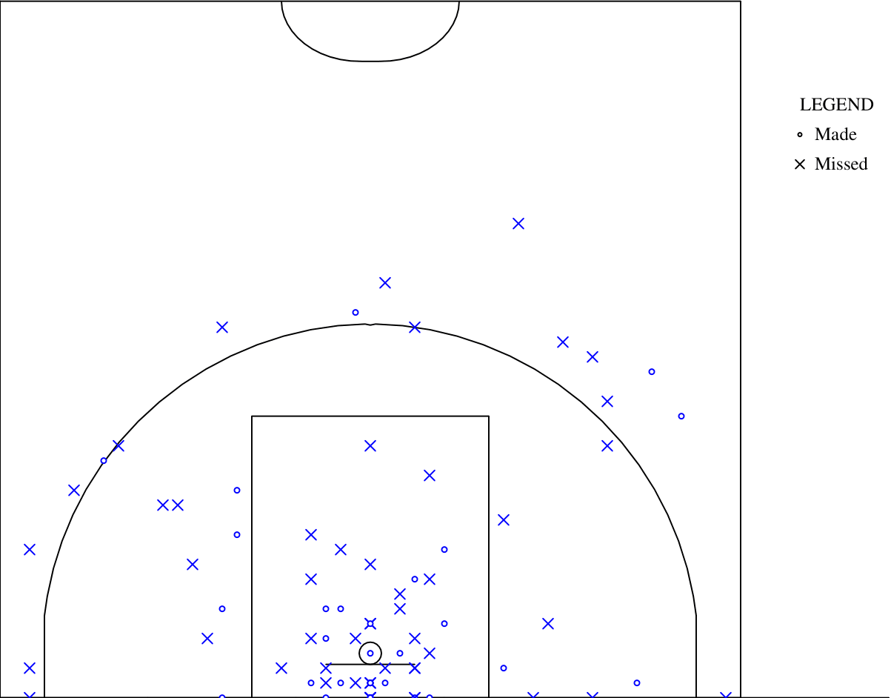
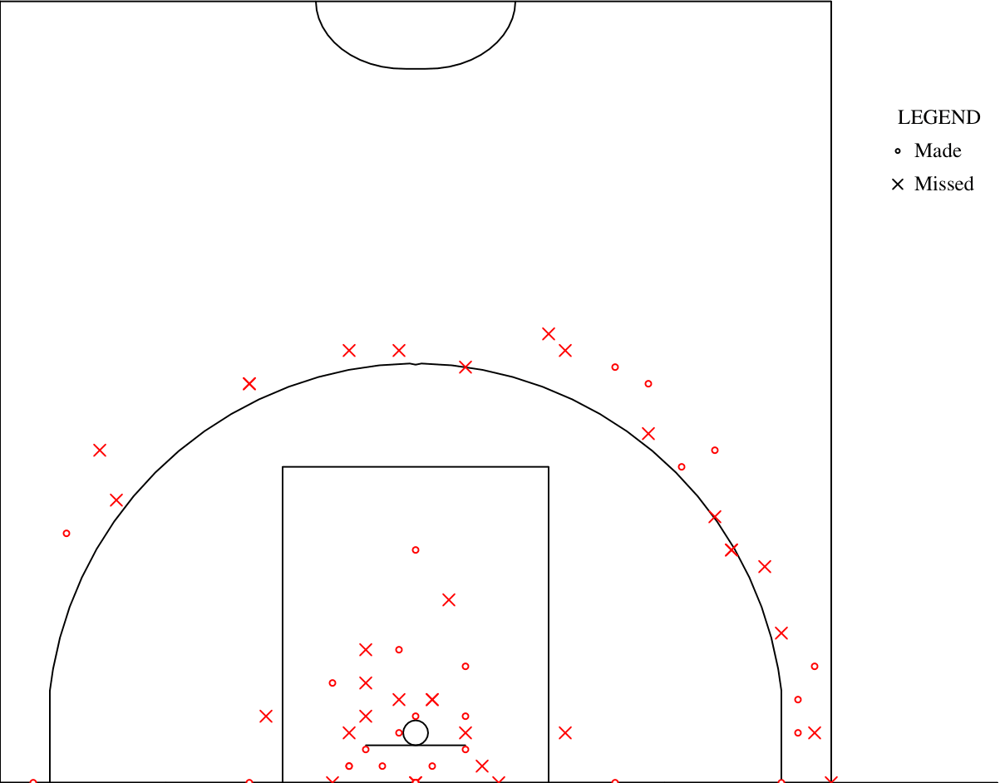

# JGraph - CS494 Lab

This project takes a link to a ESPN NCAA basketball game and ouputs a shotgraph for both the home and away teams over the course of the game.

## Build and Run
Clone the respository and run:
make

make on its own will compile with 5 NCAA games, each pdf is converted and put into a pdf folder for easy viewing.

The jgraph.cpp can also be compiled and executed as follows:
g++ -std=c++17 -Wall src/jgraph.cpp -o jgraph
./jgraph "<espn_url>"   or 
./jgraph <espn_gameId>

Executing ./jgraph 401808271 
will output home.jgr and away.jgr which can be converted into ps and then pdf as detailed in the writeup.
Here are example pictures I took of pdf output for the above command: The game is Alabama at Tennessee 2/28/26

